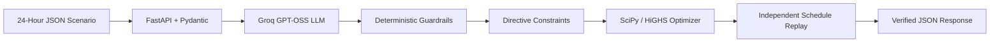

# GridWise — LLM-Assisted Smart Campus Energy Optimization

<p align="center">
  <strong>BUP CSE Fest 2026 Hackathon — Preliminary Round</strong>
</p>

<p align="center">
  
  
  
  
  
  
</p>

## Live Service

- **Base URL:** https://gridwisebaseproject.onrender.com
- **Health:** https://gridwisebaseproject.onrender.com/health
- **Swagger UI:** https://gridwisebaseproject.onrender.com/docs
- **Main endpoint:** `POST https://gridwisebaseproject.onrender.com/optimize-energy`
- **GitHub:** https://github.com/SadikRahman14/GridWiseBaseProject

The deployed service has been verified end-to-end from Postman: request validation, hosted LLM interpretation, deterministic guardrails, directive application, linear optimization, independent schedule replay, and final JSON response all execute through the public Render deployment.

---

## Table of Contents

- [Project Description](#project-description)
- [Current Project Status](#current-project-status)
- [Features](#features)
- [Architecture](#architecture)
- [Supported Directives](#supported-directives)
- [API Contract](#api-contract)
- [Optimization Model](#optimization-model)
- [Validation and Guardrails](#validation-and-guardrails)
- [Technologies Used](#technologies-used)
- [Installation](#installation)
- [Environment Configuration](#environment-configuration)
- [Running Locally](#running-locally)
- [Testing](#testing)
- [Postman / Deployed API Testing](#postman--deployed-api-testing)
- [Deployment](#deployment)
- [Docker](#docker)
- [Project Structure](#project-structure)
- [Security](#security)
- [Known Limitations](#known-limitations)
- [Team Members](#team-members)
- [References](#references)

---

## Project Description

**GridWise** is an LLM-assisted smart-campus energy optimization API developed for the **BUP CSE Fest 2026 Hackathon**.

The service receives a 24-hour scenario containing:

- campus electricity demand,
- rooftop solar availability,
- hourly grid tariffs,
- battery parameters, and
- 1–3 natural-language operator notes.

The core problem is not only optimization. The service must first understand human-written operating instructions, convert each note into a machine-checkable directive, validate the LLM output deterministically, apply the resulting constraints, and only then solve the 24-hour energy scheduling problem.

The LLM is therefore part of the real operator-note interpretation path. It **does not directly generate the final schedule**.

---

## Current Project Status

| Area | Current status |
|---|---|
| FastAPI backend | ✅ Working |
| `GET /health` | ✅ Working locally and on Render |
| `POST /optimize-energy` | ✅ Working locally and on Render |
| Hosted LLM | ✅ Groq `openai/gpt-oss-20b` |
| Structured LLM output | ✅ JSON object mode + Pydantic validation |
| Directive application | ✅ Independently tested |
| SciPy/HiGHS optimizer | ✅ Working |
| Independent schedule replay | ✅ Working |
| Public sample cases | ✅ 10/10 live cases passed |
| Directive application evaluator | ✅ 10/10 passed |
| Reliability test | ✅ 10/10 successful, 0 provider/schema failures |
| Public Render deployment | ✅ Live |
| Local Dockerfile | ✅ Present |

### Latest reliability snapshot

A 10-request live reliability run produced:

```text
Successful:             10/10
Failed:                 0/10
Success rate:           100.0%
Provider/LLM failures:  0
Schema failures:        0
Other failures:         0
Average latency:        1.980s
p50 latency:            1.298s
p95 latency:            5.752s
Maximum latency:        5.752s
```

Latency depends on the hosted LLM provider and network conditions. The challenge timeout remains 30 seconds per `/optimize-energy` request.

---

## Features

### 1. LLM-Based Operator-Note Interpretation

- Interprets natural-language energy instructions.
- Handles paraphrases, percentages, fractions, time windows, and irrelevant notes.
- Returns exactly one structured interpretation per operator note.
- Uses a hosted Groq OpenAI-compatible Chat Completions API.
- Current model: `openai/gpt-oss-20b`.
- Current hosted configuration uses low reasoning effort to reduce completion-token usage while preserving tested interpretation accuracy.

### 2. Deterministic Guardrails

- Treats model output as untrusted structured data.
- Checks note mapping and `note_index` order.
- Validates supported directive types.
- Validates `applies` semantics.
- Validates structured-adjustment shape.
- Checks hours, numeric ranges, battery reserve bounds, and solar factors.
- Rejects invalid model output instead of silently inventing constraints.

### 3. 24-Hour Linear Optimization

- Optimizes exactly 24 hourly intervals.
- Minimizes total grid electricity cost.
- Uses SciPy `linprog` with the HiGHS solver.
- Applies operator directives as hard constraints before solving.

### 4. Battery Management

- Charging and discharging.
- Capacity and base minimum reserve enforcement.
- Per-hour charge/discharge limits.
- Directive-specific reserve constraints.
- End-of-day battery neutrality.

### 5. Solar Management

- Uses available solar before unnecessary grid purchases where economically/physically useful.
- Supports temporary solar-reduction directives.
- Allows curtailment when available generation cannot be used.
- Does not model grid export.

### 6. Independent Schedule Verification

After optimization, a separate validation layer replays the schedule and checks:

- all 24 hours,
- energy balance,
- effective solar availability,
- battery state transitions,
- battery limits,
- charge/discharge limits,
- directive-specific constraints,
- non-negative values,
- end-of-day neutrality,
- total grid energy,
- total cost, and
- peak grid usage.

---

## Architecture



### End-to-End Flow

```text
Client
  |
  | POST /optimize-energy
  v
Request Validation
  |
  v
LLM Interpretation
  |
  v
Deterministic Guardrails
  |
  v
Directive Application
  |
  v
24-Hour Linear Optimization
  |
  v
Independent Schedule Replay
  |
  v
Structured JSON Response
```

The core design principle is:

```text
Human language
    ↓
LLM interpretation
    ↓
Deterministic validation
    ↓
Mathematical optimization
    ↓
Independent verification
```

---

## Supported Directives

| Directive | Meaning | Required structured adjustment |
|---|---|---|
| `solar_reduction` | Reduce usable solar during specified hours | `{"hours":[...],"factor":number}` |
| `minimum_battery_reserve` | Keep battery energy at/above a required level | `{"hours":[...],"minimum_energy_kwh":number}` |
| `no_charge_window` | Prevent battery charging | `{"hours":[...]}` |
| `no_discharge_window` | Prevent battery discharging | `{"hours":[...]}` |
| `max_grid_window` | Limit grid import during specified hours | `{"hours":[...],"max_grid_kwh":number}` |
| `no_op` | Note does not affect the current schedule | `null` |

### Examples

```text
"Solar output will drop to about 20% from 1 PM to 3 PM."
→ solar_reduction
→ hours: [13, 14]
→ factor: 0.2
```

```text
"Do not charge the battery between 2 PM and 4 PM."
→ no_charge_window
→ hours: [14, 15]
```

```text
"Keep at least 120 kWh in reserve from 6 PM until 9 PM."
→ minimum_battery_reserve
→ hours: [18, 19, 20]
→ minimum_energy_kwh: 120
```

Time windows are **start-inclusive and end-exclusive**:

```text
1 PM to 3 PM       → [13, 14]
10 PM to midnight  → [22, 23]
```

For `solar_reduction`, `factor` is the usable fraction **remaining**:

```text
80% reduction → factor = 0.20
60% reduction → factor = 0.40
reduced to 60% → factor = 0.60
```

---

## API Contract

### `GET /health`

Local:

```text
http://127.0.0.1:8000/health
```

Production:

```text
https://gridwisebaseproject.onrender.com/health
```

Expected response:

```json
{
  "status": "ok"
}
```

### `POST /optimize-energy`

Local:

```text
http://127.0.0.1:8000/optimize-energy
```

Production:

```text
https://gridwisebaseproject.onrender.com/optimize-energy
```

The request must contain:

```text
scenario_id
operator_notes   (1–3 non-empty strings)
hours            (exactly 24 entries: 0..23)
battery
```

Each hour contains:

```text
hour
demand_kwh
solar_kwh
tariff_bdt_per_kwh
```

The battery object contains:

```text
capacity_kwh
initial_energy_kwh
minimum_energy_kwh
max_charge_kwh_per_hour
max_discharge_kwh_per_hour
```

The response contains:

```text
scenario_id
directive_interpretation
hourly_plan
total_grid_kwh
total_cost_bdt
peak_grid_kwh
plan_summary
```

### Swagger UI

- Local: http://127.0.0.1:8000/docs
- Production: https://gridwisebaseproject.onrender.com/docs

No client-side Groq API key is required. The hosted model credential is configured only on the server/deployment environment.

---

## Optimization Model

For each hour, GridWise controls:

- grid electricity,
- solar energy used,
- battery charge,
- battery discharge, and
- battery state of charge.

### Objective

```text
Minimize Σ(grid_kwh[h] × tariff_bdt_per_kwh[h])
```

### Energy Balance

```text
grid_kwh
+ solar_used_kwh
+ battery_discharge_kwh
=
demand_kwh
+ battery_charge_kwh
```

### Battery Bounds

```text
minimum_energy_kwh
≤ battery_energy_after_kwh
≤ capacity_kwh
```

### End-of-Day Neutrality

```text
battery_energy_after_hour_23 = initial_energy_kwh
```

This prevents the optimizer from treating the battery's initial stored energy as free one-time energy.

---

## Validation and Guardrails

GridWise validates the LLM interpretation before it is applied to the optimizer.

Checks include:

- exactly one interpretation per note,
- correct `note_index`,
- only supported directive types,
- `no_op` uses `applies=false` and `structured_adjustment=null`,
- every other directive uses `applies=true`,
- sorted unique integer hours in `0..23`,
- finite numeric values,
- solar factors in valid range,
- valid battery reserve values,
- valid grid-cap values,
- exact structured-adjustment shapes,
- no unauthorized changes to demand, tariff, solar, or battery inputs.

There is deliberately **no regex-only semantic fallback** replacing the required LLM interpretation path.

---

## Technologies Used

| Area | Technology |
|---|---|
| Language | Python 3.12 |
| API | FastAPI |
| Validation | Pydantic |
| HTTP client | HTTPX |
| Hosted LLM provider | Groq |
| Hosted model | `openai/gpt-oss-20b` |
| LLM API style | OpenAI-compatible Chat Completions |
| Optimization | SciPy `linprog` |
| LP solver | HiGHS |
| ASGI server | Uvicorn |
| Deployment | Render |
| Containerization | Docker |
| Version control | Git + GitHub |

---

## Installation

### Prerequisites

- Git
- Python 3.12 recommended
- pip
- A valid, authorized LLM API credential for the configured hosted provider
- Docker (optional for local container testing)

### Clone the Repository

```bash
git clone https://github.com/SadikRahman14/GridWiseBaseProject.git
cd GridWiseBaseProject
```

### Windows PowerShell

Create a virtual environment:

```powershell
py -3.12 -m venv .venv
```

If Python 3.12 is already your default:

```powershell
python -m venv .venv
```

Install dependencies:

```powershell
.venv\Scripts\python.exe -m pip install --upgrade pip
.venv\Scripts\python.exe -m pip install -r requirements.txt
```

For development/test dependencies when needed:

```powershell
.venv\Scripts\python.exe -m pip install -r requirements-dev.txt
```

### Linux / macOS

```bash
python3.12 -m venv .venv
.venv/bin/python -m pip install --upgrade pip
.venv/bin/python -m pip install -r requirements.txt
```

---

## Environment Configuration

Copy the example configuration if `.env.example` is present:

### Windows

```powershell
Copy-Item .env.example .env
```

### Linux / macOS

```bash
cp .env.example .env
```

For the currently deployed hosted-model configuration, use the following **variable names**:

```dotenv
LLM_PROVIDER=openai-compatible
LLM_BASE_URL=https://api.groq.com/openai/v1
LLM_MODEL=openai/gpt-oss-20b
LLM_API_KEY=YOUR_AUTHORIZED_GROQ_KEY
LLM_TIMEOUT_SECONDS=22
LLM_RETRIES=2
PORT=8000
```

> Do not commit `.env`, API keys, access tokens, or secret values.

The current model request is configured for JSON output and low reasoning effort. This reduced one measured two-note warmup from approximately 1105 total tokens to approximately 891 total tokens while preserving the expected interpretation in that test.

---

## Running Locally

### Start the API

Windows:

```powershell
.venv\Scripts\python.exe run.py
```

Linux/macOS:

```bash
.venv/bin/python run.py
```

The service is available at:

```text
http://127.0.0.1:8000
```

### Health Check

PowerShell / Command Prompt:

```powershell
curl.exe http://127.0.0.1:8000/health
```

Expected:

```json
{"status":"ok"}
```

---

## Testing

### 1. Offline Public-Sample Verification

This does not call the hosted LLM:

```powershell
.venv\Scripts\python.exe scripts\check_samples.py --mode offline
```

### 2. Real LLM Warmup

Use a single hosted-model call to confirm credentials/model configuration:

```powershell
.venv\Scripts\python.exe scripts\warmup.py
```

A successful run prints a real `directive_interpretation` response.

### 3. Live Public-Sample Verification

```powershell
.venv\Scripts\python.exe scripts\check_samples.py --mode live
```

**Current result: 10/10 public live samples passed.**

The current live checker intentionally spaces requests to reduce hosted-provider rate-limit pressure, so a full live run may take several minutes.

### 4. Language Evaluation

```powershell
.venv\Scripts\python.exe evaluation\eval_language.py
```

The language suite covers:

- solar reduction,
- battery reserve,
- no-charge windows,
- no-discharge windows,
- grid import caps,
- `no_op`,
- percentages/fractions,
- alternate time expressions, and
- paraphrased operator notes.

### 5. Multi-Note Evaluation

```powershell
.venv\Scripts\python.exe evaluation\eval_multi_note.py
```

Tests combinations of 2–3 notes and note-order preservation.

### 6. Directive Application Evaluation

```powershell
.venv\Scripts\python.exe evaluation\eval_application.py
```

**Current result: 10/10 passed.**

This evaluator independently checks that the organizer-style ground-truth directive constraints are reflected in the returned 24-hour schedule.

### 7. Performance / Reliability Evaluation

```powershell
.venv\Scripts\python.exe -u evaluation\stress_test.py --requests 10 --delay 2
```

Current recorded result:

```text
10/10 success
0 provider/LLM failures
0 schema failures
Average: 1.980s
p50:     1.298s
p95:     5.752s
Max:     5.752s
```

### 8. Automated Unit Tests

```powershell
.venv\Scripts\python.exe -m pytest
```

---

## Postman / Deployed API Testing

### Health

```text
Method: GET
URL: https://gridwisebaseproject.onrender.com/health
```

Expected:

```json
{
  "status": "ok"
}
```

### Optimization

```text
Method: POST
URL: https://gridwisebaseproject.onrender.com/optimize-energy
Header: Content-Type: application/json
```

Use `examples/sample_request.json`, or send any request matching the official 24-hour schema.

A deployed Postman verification using:

```text
"Expect an 80% reduction in rooftop solar from 1 PM until 3 PM."
"The cafeteria will introduce a new menu next week."
```

correctly returned:

```json
[
  {
    "note_index": 0,
    "applies": true,
    "directive_type": "solar_reduction",
    "structured_adjustment": {
      "hours": [13, 14],
      "factor": 0.2
    }
  },
  {
    "note_index": 1,
    "applies": false,
    "directive_type": "no_op",
    "structured_adjustment": null
  }
]
```

The same deployed response returned a valid 24-hour plan, respected the reduced solar availability, preserved battery limits and neutrality, and reported internally consistent totals.

### Curl against the deployed API

Linux/macOS:

```bash
curl -X POST \
  https://gridwisebaseproject.onrender.com/optimize-energy \
  -H "Content-Type: application/json" \
  --data-binary @examples/sample_request.json
```

Windows PowerShell:

```powershell
curl.exe -X POST `
  "https://gridwisebaseproject.onrender.com/optimize-energy" `
  -H "Content-Type: application/json" `
  --data-binary "@examples/sample_request.json"
```

---

## Deployment

GridWise is currently deployed on **Render**.

### Production endpoints

```text
GET  https://gridwisebaseproject.onrender.com/health
POST https://gridwisebaseproject.onrender.com/optimize-energy
GET  https://gridwisebaseproject.onrender.com/docs
```

The deployment must keep these environment variables configured in Render rather than in source control:

```text
LLM_PROVIDER
LLM_BASE_URL
LLM_MODEL
LLM_API_KEY
LLM_TIMEOUT_SECONDS
LLM_RETRIES
PORT
```

The application binds to `0.0.0.0` and reads the platform-provided `PORT`.

### Render deployment verification

The public endpoint has been manually tested from outside the local development process with Postman. Both `/health` and `/optimize-energy` are reachable and return valid JSON.

---

## Docker

A Dockerfile is included for local/fallback execution.

### Build

```bash
docker build -t gridwise:1.0.0 .
```

### Run

```bash
docker run --rm \
  -p 8000:8000 \
  --env-file .env \
  gridwise:1.0.0
```

Windows PowerShell equivalent:

```powershell
docker run --rm -p 8000:8000 --env-file .env gridwise:1.0.0
```

### Verify

```bash
curl http://127.0.0.1:8000/health
```

Expected:

```json
{"status":"ok"}
```

### Submission note

The challenge requires a **pullable Docker fallback image with an exact tag or digest**. The repository contains the Dockerfile, but do not claim a registry image in the submission until the team has actually pushed and tested one.

The image must never contain:

- `.env`,
- API keys,
- access tokens,
- passwords, or
- other private credentials.

---

## Project Structure

```text
GridWiseBaseProject/
│
├── gridwise/
│   ├── api.py
│   ├── directives.py
│   ├── errors.py
│   ├── llm.py
│   ├── models.py
│   ├── optimizer.py
│   ├── prompts.py
│   ├── settings.py
│   └── validation.py
│
├── evaluation/
│   ├── language_cases.json
│   ├── language_cases_phase2.json
│   ├── multi_note_cases.json
│   ├── eval_language.py
│   ├── eval_multi_note.py
│   ├── eval_application.py
│   └── stress_test.py
│
├── examples/
│   ├── sample_request.json
│   └── sample_reference_response.json
│
├── scripts/
│   ├── demo.py
│   ├── check_samples.py
│   └── warmup.py
│
├── tests/
├── docs/
├── run.py
├── Dockerfile
├── requirements.txt
├── requirements-dev.txt
├── .env.example
└── README.md
```

---

## Security

- `.env` must remain ignored by Git.
- API keys must never be committed.
- The public `/optimize-energy` client does not receive the Groq key.
- Secret values are configured only through the local environment or Render environment variables.
- Raw credentials must not appear in logs, API responses, README examples, screenshots, or Docker images.
- The service uses only synthetic challenge data.

Useful local checks before pushing:

```powershell
git status
git diff
git check-ignore .env
```

`git check-ignore .env` should confirm that `.env` is ignored.

---

## Known Limitations

- Interpretation quality depends on the configured language model/provider.
- Hosted-model execution depends on provider availability, quota, token limits, and rate limits.
- Network/provider variance can affect p95 latency even when local optimization is fast.
- Grid export is not modeled.
- The optimizer is intentionally specialized for the challenge's 24-hour horizon.
- There is no regex-only or non-LLM semantic fallback interpreter.
- Peak grid usage is reported but is not a secondary optimization objective.
- The Dockerfile is present, but a pullable registry image must be separately published/tested for the official fallback submission requirement.

---

## Team Members

| Name | Role |
|---|---|
| KM Hasibur Rahman | Lead |
| Sadik Rahman | Developer |
| Kazi Kamruddin Ahmed | Tester |

---

## References

1. **BUP CSE Fest 2026 Hackathon — Preliminary Problem Statement: GridWise LLM**
2. **BUP CSE Fest 2026 — Participant Guide & Evaluation Rubric**
3. FastAPI
4. Pydantic
5. HTTPX
6. SciPy / HiGHS
7. Groq OpenAI-compatible API
8. Uvicorn
9. Docker
10. Render

---

## Final Links

- **Live API:** https://gridwisebaseproject.onrender.com
- **Health Check:** https://gridwisebaseproject.onrender.com/health
- **Swagger UI:** https://gridwisebaseproject.onrender.com/docs
- **GitHub Repository:** https://github.com/SadikRahman14/GridWiseBaseProject

