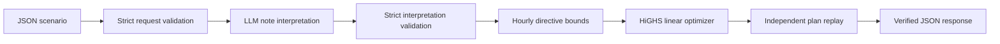

# GridWise — Phase 3 starter project

A runnable base solution for the BUP CSE Fest 2026 preliminary energy challenge.
It implements the required API, model-based operator-note interpretation, deterministic
guardrails, optimal 24-hour scheduling, and independent schedule replay.

This is the latest tracked edition of the project: **Phase 3 — adversarial language
evaluation**. It retains application version `1.0.0` and adds a broader, repeatable
language-interpretation evaluation pack around the original optimizer and API.

**Start with `START_HERE.txt` if you are on Windows.** The offline optimizer demo is
ready to run after installing dependencies. The full API needs your local model or
hosted model configuration. There are no bundled model weights or secret keys.

## At a glance

| Item | Current state |
|---|---|
| Project edition | Phase 3 — adversarial language evaluation |
| Application/API version | `1.0.0` |
| Runtime | 64-bit Python 3.11–3.13; Python 3.12 recommended |
| Web layer | FastAPI served by Uvicorn |
| Optimization | Continuous linear programming with SciPy/HiGHS |
| Model backends | Local Ollama or an OpenAI-compatible Chat Completions endpoint |
| Public optimizer pack | 10 supplied cases with published optimal costs |
| Current language pack | 30 live-model cases across all six directive types |
| Recorded automated verification | 95 tests passed; see `docs/VERIFICATION.md` |

## Contents

- [What is implemented](#what-is-implemented)
- [How the system works](#how-the-system-works)
- [Choose a run mode](#choose-a-run-mode)
- [Install on Windows](#1-install-on-windows)
- [Install on macOS or Linux](#2-install-on-macos-or-linux)
- [Configure the language model](#3-configure-the-real-language-model)
- [Start and use the API](#4-start-and-use-the-api)
- [Test and evaluate](#5-test-your-model-and-changes)
- [Configuration reference](#6-configuration-reference)
- [Docker and deployment](#7-docker-and-eventual-deployment)
- [Repository map and extension points](#8-repository-map-and-extension-points)
- [Reliability and security](#9-reliability-and-security)
- [Troubleshooting and known limits](#10-troubleshooting-and-known-limits)

## What is implemented

- `GET /health`: `200 {"status":"ok"}` when the configured model is available.
- `POST /optimize-energy`: the exact interpretation + schedule response contract.
- All six directive types, including irrelevant notes as `no_op`.
- Strict request and model-output validation, one interpretation per note, and controlled errors.
- Continuous linear programming with SciPy/HiGHS and one signed battery flow per hour.
- Every-hour energy balance, reserves, grid caps, charge/discharge windows, curtailment,
  battery rate/capacity limits, and end-of-day battery neutrality.
- Independent replay before a successful response; totals come from the returned plan.
- Ollama and configurable OpenAI-compatible Chat Completions adapters.
- Public sample checker, an offline demonstration, automated tests, and a Dockerfile.
- A 30-case Phase 3 language suite covering alternate wording, 12/24-hour times,
  noon/midnight boundaries, fractional solar output, and irrelevant-note rejection.

The optimizer matches the published optimal costs for all 10 supplied public cases
when given their published interpretations. This is not a claim that a particular
live model interprets every note correctly. See `docs/VERIFICATION.md`.

## How the system works

GridWise deliberately separates probabilistic language understanding from
deterministic scheduling. The model may only translate operator notes into one of
the six supported directive shapes. It cannot directly construct or approve a
schedule.



The request lifecycle is:

1. FastAPI and Pydantic reject malformed input, unknown fields, implicit string
   coercion, missing hours, duplicate hours, and invalid battery bounds.
2. The configured model receives the operator notes, battery context, a fixed
   system prompt, and the exact structured-output schema.
3. The returned JSON must contain exactly one interpretation for each input note,
   in order, using only the supported directive types and value ranges.
4. `gridwise/directives.py` converts valid interpretations into hourly solar,
   reserve, grid, charge, and discharge bounds.
5. `gridwise/optimizer.py` minimizes tariff-weighted grid purchases while enforcing
   hourly energy balance, battery constraints, directive bounds, and end-of-day
   battery neutrality.
6. `gridwise/validation.py` independently replays the candidate schedule. A response
   is returned only if every balance, bound, total, and directive still holds.

### Supported directives

| Directive type | Structured adjustment | Scheduling effect |
|---|---|---|
| `solar_reduction` | `hours`, `factor` | Multiplies original solar availability by the remaining fraction |
| `minimum_battery_reserve` | `hours`, `minimum_energy_kwh` | Raises the minimum stored energy after each affected hour |
| `no_charge_window` | `hours` | Forces battery charge to zero during the listed hours |
| `no_discharge_window` | `hours` | Forces battery discharge to zero during the listed hours |
| `max_grid_window` | `hours`, `max_grid_kwh` | Caps grid import independently in each listed hour |
| `no_op` | `null` | Records an irrelevant note without changing the schedule |

Hours use a start-inclusive, end-exclusive convention. For example, 1 PM to 3 PM
becomes `[13, 14]`, while 10 PM to midnight becomes `[22, 23]`. A solar reduction
“by 60%” leaves a factor of `0.4`; output reduced “to 60%” uses `0.6`.

### Optimization model in brief

For every hour `h`, the LP uses four continuous variables:

| Variable | Meaning |
|---|---|
| `g[h]` | Grid energy purchased |
| `s[h]` | Available solar energy actually used |
| `b[h]` | Signed battery flow: positive for charge, negative for discharge |
| `e[h]` | Battery energy stored after the hour |

It minimizes `sum(g[h] * tariff[h])` subject to hourly energy balance
`g[h] + s[h] - b[h] = demand[h]`, battery state transitions, active directive
bounds, and `e[23] = initial_energy`. The resulting model has 96 continuous
variables and 49 equality constraints. One signed battery variable makes charging
and discharging mutually exclusive without binary variables under the challenge's
lossless-battery rules. Solar may be curtailed; grid export is not modeled.

Peak import is reported but is not a second optimization objective. Equivalent
optimal plans may therefore differ in hourly actions or peak while retaining the
same minimum grid cost. See `docs/ARCHITECTURE.md` for the complete formulation,
constraint-combination rules, numerical tolerances, and assumptions.

This boundary is important: model output is treated as untrusted structured input.
A malformed interpretation, infeasible scenario, optimizer failure, replay failure,
or deadline breach produces a controlled error instead of an unverified plan.

## Choose a run mode

| Goal | Model required? | Recommended command |
|---|---:|---|
| Verify installation and optimizer | No | `python scripts/demo.py` |
| Check all published optimal costs | No | `python scripts/check_samples.py --mode offline` |
| Use the complete API locally | Yes | `python run.py` |
| Test model interpretation on public samples | Yes | `python scripts/check_samples.py --mode live` |
| Run the Phase 3 language suite | Yes | `python evaluation/eval_language.py` |

The command names above use a generic `python` for readability. The installation
sections use the exact virtual-environment executable for each operating system.

## 1. Install on Windows

Use **64-bit Python 3.12**. Python 3.11-3.13 are intended targets; verification was
performed with Python 3.12 on Linux. Python and libraries are not included in the ZIP.
Download Python from [python.org](https://www.python.org/downloads/).

Extract the entire ZIP, then double-click `setup_windows.bat`. It creates `.venv`,
installs the pinned dependencies, and creates `.env` without overwriting an existing one.
No PowerShell execution-policy change is needed.

To do the same manually, open PowerShell in the extracted project folder:

```powershell
py -3.12 -m venv .venv
.venv\Scripts\python.exe -m pip install -r requirements-dev.txt
Copy-Item .env.example .env
.venv\Scripts\python.exe scripts\demo.py
.venv\Scripts\python.exe scripts\check_samples.py --mode offline
```

Do not repeat `Copy-Item` over a `.env` you already configured. The automated setup
script checks for an existing file before copying.

`demo_windows.bat` runs the sample checker and a demonstration. It writes
`output/demo_response.json`, containing a complete calculated 24-hour plan.
For SAMPLE-01, the expected optimum is **38365.00 BDT**, total grid energy
**2692.50 kWh**, and final battery energy **110 kWh**. Equivalent optimal schedules
can have different hourly decisions and peaks.

**Offline means optimizer-only:** these commands deliberately supply the organizer's
structured interpretations. They do not test or replace the competition's LLM path.

## 2. Install on macOS or Linux

From the extracted project directory, with Python 3.12 available:

```bash
bash setup.sh
.venv/bin/python scripts/demo.py
.venv/bin/python scripts/check_samples.py --mode offline
```

On distributions without venv support, install your distribution's Python venv
package first. You can also create the environment using `python3.12 -m venv .venv`.
In the instructions below, substitute `.venv/bin/python` for the Windows Python path.

## 3. Configure the real language model

### Option A: local Ollama, no API key

Install [Ollama](https://ollama.com/download), launch it, and download the model:

```bash
ollama pull qwen2.5:3b
```

If your installation does not already run its server, run `ollama serve` in a
separate terminal. If it reports that port 11434 is already in use, the server may
already be running; use `ollama list` to check the installation.

The default `.env` is:

```dotenv
LLM_PROVIDER=ollama
LLM_BASE_URL=http://127.0.0.1:11434
LLM_MODEL=qwen2.5:3b
LLM_API_KEY=
LLM_TIMEOUT_SECONDS=22
LLM_RETRIES=1
PORT=8000
```

Warm the model before timed API tests:

```powershell
.venv\Scripts\python.exe scripts\warmup.py
```

The model is an editable starting choice, not a benchmarked recommendation for
winning the contest. Its speed and interpretation quality must be tested on your
hardware. Larger models may improve interpretation but use more memory and time.
The initial download needs internet and disk space. Subsequent inference can run locally.
The warmup script allows extra time for loading weights; judged API calls keep a
strict time budget. Switch to a faster model/provider if inference cannot meet it.

### Option B: hosted OpenAI-compatible provider

Edit `.env`, replacing the provider, URL, model and key:

```dotenv
LLM_PROVIDER=openai-compatible
LLM_BASE_URL=https://api.groq.com/openai/v1
LLM_MODEL=YOUR_PROVIDER_MODEL_ID
LLM_API_KEY=YOUR_PRIVATE_KEY
LLM_TIMEOUT_SECONDS=22
LLM_RETRIES=1
PORT=8000
```

The Groq URL is an example compatible endpoint; select an available model in your
own provider account. Other providers can be used by changing the base URL and
model. Your chosen endpoint must support `GET /models` and `POST /chat/completions`
with non-streaming JSON-object output, `temperature`, and `max_tokens`. Providers
or models that require a different API contract need a change in `gridwise/llm.py`.
This starter does not assume that every model marketed as compatible supports
every parameter. See the provider's current documentation before choosing a model.

Only synthetic operator notes and battery parameters are sent to the model.
The API key is a request header; it is never inserted into a prompt or response.
Keep `.env` local and out of version control. Restart the server after changing it.
Environment variables supplied by a host take priority over `.env`.

## 4. Start and use the API

Windows: double-click `start_windows.bat`, or run:

```powershell
.venv\Scripts\python.exe run.py
```

macOS/Linux:

```bash
.venv/bin/python run.py
```

The process binds to `0.0.0.0:8000` by default. Open these locally:

- [Interactive API documentation](http://127.0.0.1:8000/docs)
- [Readiness check](http://127.0.0.1:8000/health)

### Endpoints

| Method and path | Purpose | Successful result |
|---|---|---|
| `GET /health` | Check whether the configured provider and model are reachable | `200 {"status":"ok"}` |
| `POST /optimize-energy` | Interpret notes, optimize the day, replay the plan, and return it | `200` with a `PlanResponse` |
| `GET /docs` | Open the generated Swagger request editor | Interactive HTML documentation |

`/health` returns `503` when the configured model is unavailable. Its readiness
result is cached for three seconds. The optimization endpoint has a 28-second total
request deadline, while the model's configurable budget may be at most 25 seconds.

### Request contract

`POST /optimize-energy` accepts one scenario object:

| Field | Requirements |
|---|---|
| `scenario_id` | Non-empty string; echoed unchanged in the successful response |
| `operator_notes` | One to three non-empty strings |
| `hours` | Exactly 24 entries containing every integer hour from `0` through `23` once |
| `hours[].demand_kwh` | Finite, non-negative JSON number |
| `hours[].solar_kwh` | Finite, non-negative JSON number |
| `hours[].tariff_bdt_per_kwh` | Finite, non-negative JSON number |
| `battery.capacity_kwh` | Finite, non-negative JSON number |
| `battery.initial_energy_kwh` | Must be between the minimum energy and capacity |
| `battery.minimum_energy_kwh` | Finite, non-negative JSON number |
| `battery.max_charge_kwh_per_hour` | Finite, non-negative JSON number |
| `battery.max_discharge_kwh_per_hour` | Finite, non-negative JSON number |

Unknown fields and numeric strings are rejected. Input hour entries may arrive in
any order; successful output is always chronological. The complete example request
is `examples/sample_request.json`.

On `/docs`, expand `POST /optimize-energy`, click **Try it out**, replace the example
with `examples/sample_request.json`, and click **Execute**. The documentation UI
loads its Swagger assets from a CDN and therefore needs internet in the browser;
the API itself can work locally with Ollama.

PowerShell commands, from a second terminal in this folder:

```powershell
Invoke-RestMethod http://127.0.0.1:8000/health
$gridwiseBody = Get-Content examples/sample_request.json -Raw
$gridwiseResult = Invoke-RestMethod -Method Post -Uri http://127.0.0.1:8000/optimize-energy -ContentType 'application/json' -Body $gridwiseBody
$gridwiseResult | ConvertTo-Json -Depth 20
```

Portable curl examples (use `curl.exe` in Windows PowerShell):

```bash
curl http://127.0.0.1:8000/health
curl -X POST http://127.0.0.1:8000/optimize-energy -H "Content-Type: application/json" --data-binary @examples/sample_request.json
```

A successful response includes `scenario_id`, `directive_interpretation`,
`hourly_plan`, `total_grid_kwh`, `total_cost_bdt`, `peak_grid_kwh`, and `plan_summary`.
The complete official reference response is `examples/sample_reference_response.json`.

### Response contract

| Field | Meaning |
|---|---|
| `scenario_id` | The request identifier, echoed verbatim |
| `directive_interpretation` | One validated structured entry per operator note |
| `hourly_plan` | Exactly 24 chronological grid, solar, battery-action, and battery-state entries |
| `total_grid_kwh` | Sum of returned hourly grid imports |
| `total_cost_bdt` | Sum of hourly grid import multiplied by that hour's tariff |
| `peak_grid_kwh` | Largest hourly grid import in the returned plan |
| `plan_summary` | Short human-readable summary of the verified plan |

Expected controlled failures include `400 invalid_request` for malformed request
data and `422 infeasible_scenario` when no schedule can satisfy all hard constraints.
Model, optimizer, replay, and timeout failures return credential-free error objects
without fabricating a fallback interpretation or schedule.

## 5. Test your model and changes

The repository has complementary checks rather than one all-purpose test command:

| Check | Needs API? | Needs model? | What it proves |
|---|---:|---:|---|
| `python -m pytest` | No | No | Validation, adapter contracts, optimizer behavior, replay, and failure handling |
| `scripts/demo.py` | No | No | One complete offline request-to-plan demonstration |
| `scripts/check_samples.py --mode offline` | No | No | Optimizer and replay against all 10 published interpretations and costs |
| `scripts/check_samples.py --mode live` | Yes | Yes | End-to-end interpretation, optimization, accuracy, and latency on public cases |
| `evaluation/eval_language.py` | Yes | Yes | Phase 3 paraphrase, time-expression, numeric, and relevance handling |

With the service and model running:

```powershell
.venv\Scripts\python.exe scripts\check_samples.py --mode live
.venv\Scripts\python.exe -m pytest
```

For a deployed service, change `--url`:

```bash
python scripts/check_samples.py --mode live --url https://YOUR-SERVICE-URL --repeat 3
```

The live checker verifies extracted types, hours, values and relevance against
organizer truth, replays the schedule against that truth, and checks the optimal
cost. It does not require byte-for-byte equality with one reference schedule.
It reports latency, with the guide's 30-second deadline. The guide awards full
latency marks at p95 <=5 seconds; test that on your actual deployed configuration.

The 10-case public pack is copied unchanged into `examples/public_samples.json`.
It is used only by demos and tests. The production API never loads it, matches
scenario IDs, or performs a phrase lookup. Write additional paraphrase tests when
choosing your model; sample success alone does not establish hidden-case accuracy.

### Phase 3 language evaluation

With the API and your configured model running at `http://127.0.0.1:8000`, run:

```powershell
.venv\Scripts\python.exe evaluation\eval_language.py
```

On macOS or Linux:

```bash
.venv/bin/python evaluation/eval_language.py
```

The evaluator sends the 30 cases in `evaluation/language_cases.json` to
`POST /optimize-energy`, compares each returned `directive_interpretation` with
the expected structure using a numeric tolerance of `0.01`, and reports pass count,
accuracy, average latency, and p95 latency. It waits five seconds between cases to
avoid hammering the model provider, so a complete run takes at least 145 seconds
plus inference time.

The current Phase 3 pack contains five cases for each directive family:

| Cases | Coverage |
|---|---|
| `LANG-001`–`LANG-005` | Solar reductions: “by” vs “to,” fractions, noon, and 24-hour time |
| `LANG-006`–`LANG-010` | Minimum battery reserves and alternate floor wording |
| `LANG-011`–`LANG-015` | No-charge windows, including midnight and natural-language times |
| `LANG-016`–`LANG-020` | No-discharge windows and alternate storage-output wording |
| `LANG-021`–`LANG-025` | Per-hour grid caps and alternate import-ceiling wording |
| `LANG-026`–`LANG-030` | Irrelevant historical/future notices that must become `no_op` |

This is a live-model evaluation, not part of `pytest`, and it creates a real
optimization request for every case. Its URL, request timeout, and inter-case delay
are constants near the top of `evaluation/eval_language.py`. The evaluator checks
only the expected interpretation fields; the API still performs its normal schedule
optimization and validation before returning each response.

### Edition history

| Edition | Main evaluation milestone |
|---|---|
| Baseline | API, deterministic optimizer, replay validation, and all 10 public samples |
| Phase 2 | Initial six-case live language evaluator, one case per directive family |
| Phase 3 | Expanded 30-case suite with five variations per directive family |

Phase 3 is the current repository edition. The edition name describes evaluation
progress; it does not change the public API version, which remains `1.0.0`.

## 6. Configuration reference

| Variable | Default | Purpose |
|---|---|---|
| `LLM_PROVIDER` | `ollama` | `ollama` or `openai-compatible` |
| `LLM_BASE_URL` | `http://127.0.0.1:11434` | Model API base, without the chat route |
| `LLM_MODEL` | `qwen2.5:3b` | Exact installed/provider model ID |
| `LLM_API_KEY` | empty | Bearer credential when required |
| `LLM_TIMEOUT_SECONDS` | `22` | One wall-clock budget including all model attempts; max 25 |
| `LLM_RETRIES` | `1` | Additional attempts after malformed/transient output; 0-2 |
| `PORT` | `8000` | Service port; respected in the container as well |

The API limits each optimization request to 28 seconds. HiGHS gets a 2-second
solve limit. There is no automatic non-LLM fallback. Model failure results in a
controlled error, not an invented `no_op` or a fabricated schedule.

`/health` checks provider availability and model presence, with a 3-second result
cache. It does not prove interpretation accuracy, warm model weights, or guarantee
inference quota. `warmup.py` and the live checker exercise actual inference.

## 7. Docker and eventual deployment

The Dockerfile contains the Python service, dependencies, and examples. It excludes
`.env` and does not contain a model, credentials, or Ollama itself. Docker commands
are supplied for you to build and verify locally; see verification notes for current status.

For a hosted model configured in `.env`:

```bash
docker build -t gridwise:1.0.0 .
docker run --rm -p 8000:8000 --env-file .env gridwise:1.0.0
```

For Ollama running on the same Windows/macOS host with Docker Desktop:

```bash
docker run --rm -p 8000:8000 --env-file .env -e LLM_BASE_URL=http://host.docker.internal:11434 gridwise:1.0.0
```

The container must actually be able to reach your Ollama listener. A model server
bound only to loopback may need host-network configuration or an appropriate
listener configuration; do not expose its port publicly. On Linux, a local option
is `--network host` with the loopback URL (omit `-p`), if supported by your Docker
installation. Hosted model configuration is simpler for a portable fallback image.

After verifying the container and both endpoints, tag and push your own exact version:

```bash
docker tag gridwise:1.0.0 YOUR_DOCKERHUB_USER/gridwise:1.0.0
docker push YOUR_DOCKERHUB_USER/gridwise:1.0.0
docker pull YOUR_DOCKERHUB_USER/gridwise:1.0.0
docker run --rm -p 8000:8000 --env-file .env YOUR_DOCKERHUB_USER/gridwise:1.0.0
```

Replace the uppercase placeholder with your account; no registry image has been
published as part of this ZIP. Put the final exact tag or digest in your submission
README, together with a command you have actually verified. The public judging
service must not require a login, VPN, or manual setup. This ZIP does not deploy it.

## 8. Repository map and extension points

```text
GridWiseBaseProject/
├── gridwise/                 Core application package
│   ├── api.py                FastAPI routes, deadlines, and error responses
│   ├── directives.py         Structured directives to hourly hard bounds
│   ├── llm.py                Ollama/OpenAI-compatible adapters and retry handling
│   ├── models.py             Strict request, interpretation, and response schemas
│   ├── optimizer.py          SciPy/HiGHS linear program
│   ├── prompts.py            Interpretation rules supplied to the model
│   ├── settings.py           Validated environment configuration
│   └── validation.py         Independent schedule replay
├── evaluation/               Phase 2/3 live language evaluation data and runner
├── examples/                 Public cases and sample request/response JSON
├── scripts/                  Demo, public checker, and model warmup utilities
├── tests/                    Offline regression and integration tests
├── docs/                     Architecture, verification, and submission notes
├── run.py                    Local Uvicorn entry point
├── Dockerfile                Container build definition
├── requirements*.txt         Pinned runtime and development dependencies
└── START_HERE.txt            Short Windows-first setup guide
```

### Where to make common changes

| File | Change here |
|---|---|
| `gridwise/prompts.py` | Improve time, percentage, relevance and paraphrase interpretation |
| `.env` | Choose your model, endpoint, key and port |
| `gridwise/llm.py` | Provider payload, retry logic, structured-output mode |
| `gridwise/models.py` | Read the exact request/response and directive contract |
| `gridwise/directives.py` | How directives become hourly bounds |
| `gridwise/optimizer.py` | LP objective and constraints |
| `gridwise/validation.py` | Independent energy and directive replay |
| `gridwise/api.py` | HTTP behavior and error handling |
| `evaluation/language_cases.json` | Extend the current Phase 3 live-model language suite |
| `evaluation/eval_language.py` | Adjust the language evaluator URL, timeout, tolerance or pacing |
| `tests/` | Regression coverage and independent optimality checks |

Start by understanding `docs/ARCHITECTURE.md`; then select a model and run the live
sample checker. Keep the endpoint names and response fields unchanged.

### Suggested change workflow

1. Add a focused regression case before changing interpretation or optimization
   behavior. Language-only cases belong in `evaluation/language_cases.json`;
   deterministic behavior belongs in `tests/`.
2. Change the narrowest relevant component. Prompt wording normally belongs in
   `gridwise/prompts.py`; do not weaken schema or replay checks to accommodate a model.
3. Run `python -m pytest`, the offline public checker, and the demo.
4. Start the real provider, warm it, and run the public checker in live mode.
5. Run the full Phase 3 evaluator and inspect both failed fields and latency.
6. Rebuild and smoke-test the exact Docker image or deployment artifact intended for
   submission. Recheck `/health`, `/optimize-energy`, and error behavior externally.

When changing the model, repeat live checks instead of assuming that a larger or
newer model preserves structured-output behavior, latency, or provider compatibility.

## 9. Reliability and security

- **Strict trust boundaries:** request JSON and model JSON are independently parsed
  into schemas that forbid extra fields and implicit numeric-string coercion.
- **Bounded retries:** transient or malformed model responses may be retried, but all
  attempts share one wall-clock model budget rather than multiplying the timeout.
- **No silent relaxation:** infeasible directives are never dropped to force a plan.
  The API returns an explicit error when the hard constraints cannot all be met.
- **Independent replay:** the final plan is recalculated against demand, adjusted
  solar, grid bounds, battery limits, reserves, windows, totals, and terminal energy.
- **Credential handling:** API keys are read from environment configuration, sent in
  request headers, excluded from prompts, and omitted from public error messages.
- **Minimal data sharing:** only synthetic operator notes and battery parameters are
  sent to the configured model; the optimizer itself runs locally in the API process.
- **Fail-closed behavior:** unexpected exceptions return a short reference token and
  a generic message. Provider bodies, prompts, notes, and credentials are not echoed.
- **Deterministic scheduling:** once an interpretation is accepted, scheduling and
  verification do not depend on additional model output.

Keep `.env` out of version control, never bake credentials into a container image,
and avoid exposing a local Ollama listener to the public network. If a hosted model
is used, review that provider's retention, regional, quota, and structured-output
policies before deployment.

## 10. Troubleshooting and known limits

| Symptom | Action |
|---|---|
| Python command missing | Install 64-bit Python 3.12, then reopen the terminal |
| Dependency installation fails | Use Python 3.12 and working internet; inspect the installation error |
| `/health` returns 503 | Start the model service; check URL, model ID and credentials |
| `/docs` opens but optimization fails | The web service can start before the model is ready; run warmup and check `.env` |
| Local model times out | Warm it, reduce competing load, or use a faster model/hosted provider |
| HTTP 401 from model provider | Check the private key and account access; response bodies are intentionally not exposed |
| HTTP 400 from this API | Send one `case.input`, not the whole sample pack; use real JSON numbers and exactly 24 unique hours |
| HTTP 422 infeasible scenario | Review extracted notes and inputs; the service never silently drops constraints |
| Port 8000 is in use | Set `PORT=8001`, restart, and update your browser/checker URL |
| Docker cannot reach Ollama | Loopback inside the container refers to the container; configure networking as above |

- No live model accuracy, hosted latency or Windows/Docker execution guarantee is
  implied by optimizer tests. Run the supplied live checks on your final machine.
- Overlapping solar-reduction notes have no explicit combination rule in the
  supplied statement. This implementation uses the smallest remaining fraction
  relative to original solar; it does not compound factors. Confirm with organizers
  if such cases are expected. See the architecture note.
- This challenge models a lossless battery, no export and a 24-hour horizon.
  Adding efficiencies, wear, forecasting or extra optimization goals changes the
  problem and may break judge compatibility.
- No UI dashboard, database, training pipeline or account system is required.
  `/docs` is a convenient local request editor.

## Credits and sources

The specification and unchanged public cases are from the supplied BUP CSE Fest
2026 Problem Statement, Participant Guide & Evaluation Rubric, and Public Sample
Cases v2.0. They remain authoritative for the competition.

This starter was drafted with ChatGPT/Codex assistance. Review, understand, adapt
and credit that assistance according to the event's policy; do not describe the
generated base as entirely unaided work. Dependencies retain their own licenses.

- [FastAPI documentation](https://fastapi.tiangolo.com/tutorial/): HTTP application framework.
- [Pydantic documentation](https://docs.pydantic.dev/latest/): typed validation.
- [SciPy linprog documentation](https://docs.scipy.org/doc/scipy/reference/generated/scipy.optimize.linprog.html): LP interface to HiGHS.
- [HiGHS](https://highs.dev/): mathematical optimizer used through SciPy.
- [Ollama structured outputs](https://docs.ollama.com/capabilities/structured-outputs): JSON-schema output support.
- [Ollama chat API](https://docs.ollama.com/api/chat): local model request format.
- [Qwen2.5 3B model entry](https://ollama.com/library/qwen2.5:3b): default local model identifier.
- [Groq compatibility documentation](https://console.groq.com/docs/openai): example hosted base URL.
- NumPy, HTTPX, Uvicorn, python-dotenv and pytest support numerical arrays, HTTP,
  serving, local configuration and tests.
